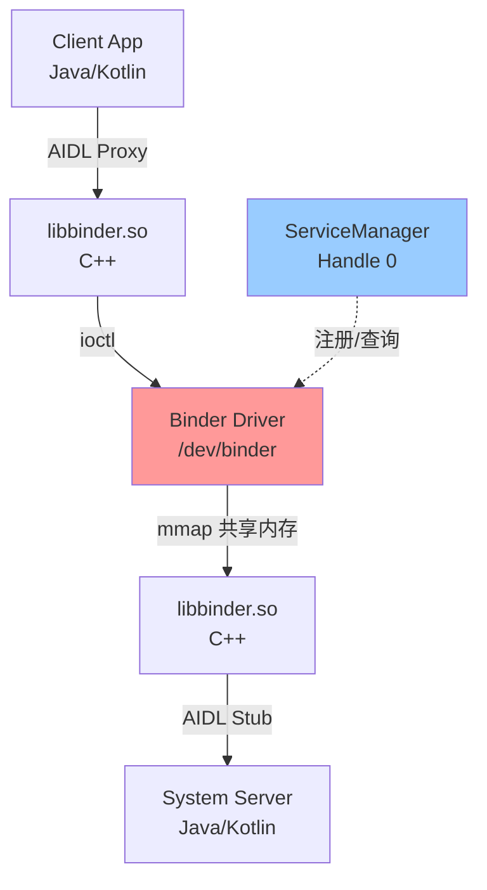
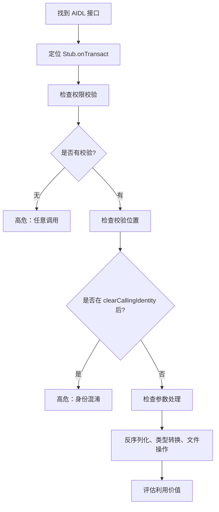

# 2x00 - Binder 深度解析

Binder 是 Android 的核心 IPC 机制，也是**系统级攻击面的主战场**。系统内绝大多数跨进程操作（从拨打电话到获取地理位置）最终都会转化为 Binder 调用。

Binder 的价值不只是"能 IPC"，而是它把三件事绑定在了一起：

- **高性能的数据传递**（共享缓冲区 + 零拷贝/一次拷贝）
- **可追溯的身份**（驱动附带 caller UID/PID，不可伪造）
- **统一的服务发现**（ServiceManager）

从攻击面角度看，Binder 是最重要的研究对象：

- **数万个系统服务接口**（每个都可能存在逻辑漏洞）
- **驱动层 C 代码**（UAF、整数溢出等内存破坏漏洞）
- **反序列化攻击**（Parcel 对象构造、类型混淆）
- **混淆代理**（Confused Deputy）
- **竞态条件**（多线程、异步回调、死亡通知）

## 1. Binder 架构详解

### 1.1 三层架构



**内核驱动层** (`drivers/android/binder.c`):
- 管理进程间的数据传递（通过 `mmap` 的共享内存池）
- 维护 Binder 对象引用计数（Node/Ref）
- 注入调用方身份（UID/PID/TID）
- 管理事务队列（todo list、wait list）
- 实现死亡通知（Death Recipient）

**用户态库层** (`frameworks/native/libs/binder`):
- `ProcessState`：单例，持有 `/dev/binder` 的 fd，管理线程池
- `IPCThreadState`：线程局部，负责事务收发（`transact/waitForResponse`）
- `BpBinder`：客户端代理，持有 handle
- `BBinder`：服务端本地对象，实现 `onTransact`
- `Parcel`：序列化/反序列化缓冲区

**框架层** (Java/Kotlin):
- `Binder` / `IBinder` 接口
- AIDL 自动生成的 Stub/Proxy
- `Parcel`（Java 层封装）

### 1.2 关键数据结构（内核视角）

```c
// 简化的内核数据结构（理解用）
struct binder_proc {
    struct rb_root nodes;          // 本进程提供的 Binder 对象
    struct rb_root refs_by_node;   // 本进程持有的远端引用
    void *buffer;                  // mmap 的共享内存
    struct list_head todo;         // 待处理事务队列
    struct list_head threads;      // 工作线程池
};

struct binder_node {
    int internal_strong_refs;      // 内部强引用计数
    void __user *ptr;              // 用户空间的 BBinder 指针
    void __user *cookie;           // 用户自定义标识
    uid_t owner_uid;               // 所有者 UID
};

struct binder_ref {
    struct binder_node *node;      // 指向目标 Binder 对象
    uint32_t desc;                 // handle 编号
};

struct binder_transaction {
    int code;                      // 方法编号
    uid_t sender_euid;             // 调用方 UID（关键！）
    pid_t sender_pid;              // 调用方 PID
    struct binder_buffer *buffer;  // 数据缓冲区
};
```

## 2. 核心机制深入

### 2.1 内存管理：mmap 与零拷贝

每个进程通过 `mmap` 在内核与用户空间之间建立一块共享内存（默认 1MB - 1 page）。

**传统 IPC（如管道）的数据流**：
```
[Client 用户空间] -> [Client 内核缓冲区] -> [Server 内核缓冲区] -> [Server 用户空间]
                   拷贝 1 次              拷贝 2 次
```

**Binder 的数据流**：
```
[Client 用户空间] -> [内核 Binder 缓冲区] == [Server mmap 区域] -> [Server 用户空间]
                   拷贝 1 次              零拷贝（映射）
```

关键点：
- Server 的 mmap 区域在内核空间有对应的物理页
- 驱动将 Client 的数据 `copy_from_user` 到这些物理页
- Server 读取时直接访问 mmap 地址，无需再次拷贝

**安全隐患**：
- mmap 区域如果被破坏（越界写、UAF），可能导致内核数据损坏
- 缓冲区耗尽（DoS 攻击，恶意占满 todo 队列）

### 2.2 线程池与调度

服务端通过 `IPCThreadState::joinThreadPool()` 启动工作线程，进入 `ioctl(BINDER_WRITE_READ)` 循环等待。

```cpp
// 简化的线程池逻辑
void joinThreadPool() {
    while (true) {
        result = ioctl(mProcess->mDriverFD, BINDER_WRITE_READ, &bwr);
        // 从 read_buffer 中解析 transaction
        executeCommand(cmd);  // 处理 BR_TRANSACTION
    }
}
```

**线程模型**：
- `max_threads` (默认 15)：进程最多支持的 Binder 线程数
- 主线程 + Binder 线程池
- 同步调用时 Client 线程会阻塞等待 reply

**竞态风险**：
- 同一服务的多个方法可能被不同线程并发调用
- 异步 `oneway` 调用不等待返回，更容易引发重入

### 2.3 身份校验：UID/PID 注入

这是 Binder 安全的核心保障。

**驱动侧实现**（简化）：
```c
static void binder_transaction(struct binder_proc *proc,
                                struct binder_thread *thread,
                                struct binder_transaction_data *tr) {
    // ...
    t->sender_euid = task_euid(proc->tsk);  // 从调用进程的 task_struct 读取
    t->sender_pid = proc->pid;
    // ...
    // 将 transaction 放入目标进程的 todo 队列
}
```

**服务端读取**（Java）：
```java
int callingUid = Binder.getCallingUid();
int callingPid = Binder.getCallingPid();
```

**关键事实**：
- UID/PID 由内核驱动填入，Client **无法伪造**
- 这些值来自进程的 `task_struct`，与文件系统权限（fsuid）可能不同
- SELinux 标签也由驱动携带，用于 MAC 检查

**常见错误**：
- 只检查 PID：PID 可复用，进程重启后可能被攻击者占据
- 未检查权限：直接信任所有调用方
- 在错误的时机检查：在 `clearCallingIdentity()` 之后

### 2.4 对象生命周期与死亡通知

Binder 采用引用计数管理对象生命周期。

**强引用（Strong Reference）**：
- 持有强引用的 Proxy 会阻止 Server 端对象被销毁
- 通过 `BC_ACQUIRE` / `BC_RELEASE` 增减计数

**死亡通知（Death Recipient）**：
- Client 可以注册回调，当 Server 进程死亡时收到通知
- 驱动在检测到进程退出时会触发 `BR_DEAD_BINDER`

**安全隐患**：
- UAF 漏洞：引用计数管理错误导致对象被过早释放
- 死亡通知竞态：回调触发时对象状态不一致

## 3. 真实漏洞案例深度分析

### 3.3 [CVE-2021-0928](../../../cves/entries/CVE-2021-0928.md) - 混淆代理（Confused Deputy）

**场景**：`PackageManagerService` 代理安装流程

**漏洞链路**：
1. 低权限应用 A 请求 `PackageInstaller` 服务安装一个 APK
2. `PackageInstaller` 作为 system_server 的一部分，拥有 `INSTALL_PACKAGES` 权限
3. `PackageInstaller` 在内部调用 `PackageManagerService.installPackage()`，此时 **calling UID 是 system_server**
4. `PackageManagerService` 没有正确追溯"原始请求方"，误以为是系统自己发起的安装
5. 应用 A 成功安装了本不该安装的 APK（如系统签名应用）

**根本原因**：
- `PackageInstaller` 在代理请求时调用了 `clearCallingIdentity()`
- `PackageManagerService` 未对"间接调用"做额外身份验证

**修复**：
- 在 PMS 中添加 "originating UID" 参数，记录真实的请求发起方
- 对系统级安装操作增加签名校验

### 3.4 Parcel 反序列化漏洞模式

**典型场景**：

```java
// Service 端代码
@Override
public boolean onTransact(int code, Parcel data, Parcel reply, int flags) {
    switch (code) {
        case TRANSACTION_doSomething: {
            data.enforceInterface(DESCRIPTOR);
            String path = data.readString();  // 可控输入
            int count = data.readInt();       // 可控输入
            
            // 危险：未校验长度
            byte[] buffer = new byte[count];  // 整数溢出 / DoS
            data.readByteArray(buffer);
            
            // 危险：未校验路径
            File file = new File(path);       // 路径遍历
            // ...
            break;
        }
    }
    return true;
}
```

**常见漏洞**：

1. **整数溢出/DoS**：
   - 读取 array 长度时未校验，导致分配巨大内存
   - `new byte[data.readInt()]` -> OOM

2. **类型混淆**：
   - 读取 `Parcelable` 时未校验实际类型
   - 攻击者传入恶意子类，触发意外的反序列化路径

3. **对象注入**：
   - 读取 `IBinder` / `FileDescriptor` 等特殊对象
   - 攻击者传入伪造的对象引用

**防御**：
- 对所有外部输入做白名单/长度限制
- 使用 `Parcel.dataAvail()` 检查剩余数据
- 在反序列化前校验类型（`instanceof`）

## 4. Binder 接口安全审计方法

### 4.1 定位高危接口

**Step 1: 枚举系统服务**
```bash
adb shell service list | grep -E "(activity|package|phone|media)"
```

**Step 2: 提取 AIDL 接口**
```bash
# 在 AOSP 源码中搜索
find frameworks/base -name "I*.aidl" | xargs grep -l "permission"
```

**Step 3: 关注关键字**
- `clearCallingIdentity()` - 身份切换
- `checkPermission()` / `enforcePermission()` - 权限检查
- `writeFileDescriptor()` - 文件描述符传递
- `oneway` - 异步调用

**高危服务清单**（按攻击价值排序）：
1. `activity` (ActivityManagerService) - 进程管理、启动组件
2. `package` (PackageManagerService) - 安装/卸载、权限授予
3. `phone` (TelephonyManager) - 短信、通话记录
4. `media.audio_flinger` (AudioFlinger) - 音频录制
5. `SurfaceFlinger` - 屏幕捕获

### 4.2 静态分析流程



**示例：审计 `PackageManagerService.installPackage()`**

1. **定位接口**：`IPackageManager.aidl`
   ```java
   void installPackage(in Uri packageURI, in IPackageInstallObserver observer,
                       int flags, in String installerPackageName);
   ```

2. **找到实现**：`PackageManagerService.java`
   ```java
   @Override
   public void installPackage(Uri packageURI, IPackageInstallObserver observer,
                              int flags, String installerPackageName) {
       // 检查权限
       mContext.enforceCallingOrSelfPermission(
           android.Manifest.permission.INSTALL_PACKAGES, null);
       
       // 获取调用方 UID
       final int callingUid = Binder.getCallingUid();
       
       // 清除身份（危险！）
       final long ident = Binder.clearCallingIdentity();
       try {
           installPackageAsUser(packageURI, observer, flags,
                                installerPackageName, UserHandle.getCallingUserId());
       } finally {
           Binder.restoreCallingIdentity(ident);
       }
   }
   ```

3. **发现问题**：
   - `clearCallingIdentity()` 后继续使用 `installerPackageName`（可控）
   - `installPackageAsUser()` 内部未重新校验调用方身份

4. **构造利用**：传入系统包名，绕过签名检查

### 4.3 动态分析与 Fuzzing

**使用 `service call` 手动测试**：
```bash
# 语法：service call <service> <code> [args...]
# 参数类型：i32 整数, i64 长整数, f 浮点, d 双精度, s16 字符串

# 示例：调用 ActivityManager.getForegroundPackageName()
adb shell service call activity 78
```

**编写 Fuzzer**（伪代码）：
```java
IBinder binder = ServiceManager.getService("target_service");
ITargetService service = ITargetService.Stub.asInterface(binder);

for (int i = 0; i < 10000; i++) {
    Parcel data = Parcel.obtain();
    Parcel reply = Parcel.obtain();
    
    // 随机 transaction code
    int code = random.nextInt(1000);
    
    // 随机数据
    data.writeInterfaceToken(service.getInterfaceDescriptor());
    data.writeInt(random.nextInt());
    data.writeString(randomString());
    
    try {
        binder.transact(code, data, reply, 0);
    } catch (RemoteException e) {
        // 记录崩溃
    }
    
    data.recycle();
    reply.recycle();
}
```

**监控崩溃**：
```bash
# 实时监控 tombstone
adb shell tail -f /data/tombstones/tombstone_*

# 或者通过 logcat
adb logcat -s DEBUG:* AndroidRuntime:E *:F
```

### 4.4 常见漏洞模式 Checklist

| 漏洞模式 | 检查点 | 示例代码特征 |
|---------|--------|------------|
| **未授权访问** | 是否检查 permission/UID | 无 `enforcePermission()` |
| **混淆代理** | `clearCallingIdentity()` 后是否使用可控参数 | `clearCalling...(); doSensitiveOp(userInput);` |
| **路径遍历** | 文件路径是否规范化 | `new File(data.readString())` |
| **整数溢出** | 数组长度是否校验 | `new byte[data.readInt()]` |
| **类型混淆** | Parcelable 反序列化是否校验类型 | `data.readParcelable()` 无 `instanceof` |
| **竞态条件** | 多线程访问共享状态 | 无同步/锁，`oneway` 调用 |
| **DoS** | 资源分配是否限制 | 无限循环、巨大分配 |
| **信息泄露** | 是否返回敏感数据给低权限 caller | 日志、错误消息包含 PII |

## 5. 高级攻击技术

### 5.1 Binder 对象伪造

**原理**：攻击者可以传递一个伪造的 `IBinder` 对象给系统服务。

**场景**：
```java
// 服务 A 的接口
interface IServiceA {
    void registerCallback(ICallback callback);
}

// 攻击者的恶意 callback
class MaliciousCallback extends ICallback.Stub {
    @Override
    public void onEvent(SensitiveData data) {
        // 窃取数据
        uploadToServer(data);
    }
}
```

如果服务 A 未校验 callback 的来源，攻击者就能收到不该收到的敏感信息。

**防御**：
- 校验 callback 的 UID
- 使用 SELinux 策略限制 Binder 通信

### 5.2 异步回调的竞态攻击

**场景**：
```java
class VulnerableService extends IService.Stub {
    private boolean isAuthorized = false;
    
    @Override
    public void authorize(String password) {
        if (checkPassword(password)) {
            isAuthorized = true;
        }
    }
    
    @Override
    public void doSensitiveOperation() {
        if (isAuthorized) {  // 竞态窗口！
            performSensitiveAction();
        }
    }
}
```

**攻击**：
1. 线程 A 调用 `authorize()` 通过验证
2. 线程 B 快速调用 `doSensitiveOperation()`
3. 如果 B 在 A 设置 `isAuthorized = true` 之后、A 退出 `authorize()` 之前执行，可能绕过检查

**防御**：
- 使用 token 而非布尔标志
- 每次操作都重新校验权限
- 使用线程安全的数据结构

### 5.3 死亡通知利用

**原理**：当服务进程崩溃时，客户端的 `DeathRecipient` 会被调用。

**攻击思路**：
1. 注册 DeathRecipient 到目标服务
2. 触发服务崩溃（如发送畸形请求）
3. 在回调中抢占资源（如重新注册同名服务）

**示例**：ServiceManager 劫持（理论，实际有 SELinux 保护）
```java
IBinder binder = ServiceManager.getService("critical_service");
binder.linkToDeath(new DeathRecipient() {
    @Override
    public void binderDied() {
        // 服务崩溃，快速注册恶意服务
        ServiceManager.addService("critical_service", maliciousBinder);
    }
}, 0);
```

## 6. 调试与观测技巧

### 6.1 Binder 状态查看

```bash
# 查看所有服务及其 PID/UID
adb shell dumpsys -l

# 查看特定服务的详细信息
adb shell dumpsys activity

# Binder 调用统计（Android 9+）
adb shell dumpsys binder_calls_stats

# Binder 线程状态（需要 root）
adb shell cat /sys/kernel/debug/binder/proc/<pid>
```

**输出解析**：
```
# /sys/kernel/debug/binder/proc/1234
context binder
  thread 1234: l 00
  thread 1235: l 11
  node 1: u00000071234abcd0 c00000071234abcd8 pri 0:139 hs 1 hw 1 ls 0 lw 0 is 1 iw 1 tr 0 proc 5678
  ref 42: desc 0 node 1 s 1 w 1
```

- `thread`: Binder 线程及其状态（l = looper 状态）
- `node`: 本进程提供的 Binder 对象
- `ref`: 本进程持有的远端引用

### 6.2 抓取 Binder 通信

**使用 Frida Hook**：
```javascript
// Hook Binder.transact()
Java.perform(function() {
    var Binder = Java.use("android.os.Binder");
    Binder.transact.implementation = function(code, data, reply, flags) {
        console.log("[Binder] transact called:");
        console.log("  code: " + code);
        console.log("  data size: " + data.dataSize());
        console.log("  callingUid: " + Binder.getCallingUid());
        
        var result = this.transact(code, data, reply, flags);
        console.log("  result: " + result);
        return result;
    };
});
```

**使用 eBPF tracing（Linux 5.5+）**：
```bash
# 跟踪 binder_ioctl
sudo bpftrace -e 'kprobe:binder_ioctl { printf("pid=%d cmd=%d\n", pid, arg1); }'
```

### 6.3 实战：定位一个系统服务的入口

目标：找到 `PackageManagerService.installPackage()` 的 transaction code

**方法 1：阅读 AIDL**
```java
// IPackageManager.aidl
interface IPackageManager {
    void installPackage(...);  // 假设是第 5 个方法
}

// 自动生成的 Stub.java
static final int TRANSACTION_installPackage = (IBinder.FIRST_CALL_TRANSACTION + 4);
// FIRST_CALL_TRANSACTION = 1, 所以 code = 5
```

**方法 2：动态调试**
```bash
# 使用 Frida hook
frida -U -f com.android.vending -l hook_pm.js

# 在 hook_pm.js 中
Java.perform(function() {
    var PackageManagerProxy = Java.use("android.content.pm.IPackageManager$Stub$Proxy");
    PackageManagerProxy.installPackage.implementation = function() {
        console.log("[+] installPackage called!");
        console.log("    Transaction code: " + this.$transactionCode);
        return this.installPackage.apply(this, arguments);
    };
});
```

## 7. 总结

Binder 是 Android 安全研究的核心战场。理解其实现细节，不仅能帮助我们发现系统级漏洞，也能在应用审计时识别高危的 IPC 使用模式。

**关键要点**：
1. **驱动层漏洞**影响所有 Android 设备，是 0day 的主要来源
2. **系统服务接口**数量庞大，是逻辑漏洞的富矿
3. **混淆代理**是最常见的设计缺陷
4. **Parcel 反序列化**需要极其谨慎地处理
5. **竞态条件**在异步/多线程场景下频繁出现

## 参考（AOSP）

- **AIDL 概览**：https://source.android.com/docs/core/architecture/aidl
- **HIDL Binder IPC**：https://source.android.com/docs/core/architecture/hidl/binder-ipc
- **架构总览**：https://source.android.com/docs/core/architecture
- **SELinux 策略**：https://source.android.com/docs/security/features/selinux
- **Binder 驱动源码**：`drivers/android/binder.c` (内核代码)
- **libbinder 源码**：`frameworks/native/libs/binder/`
